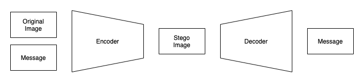
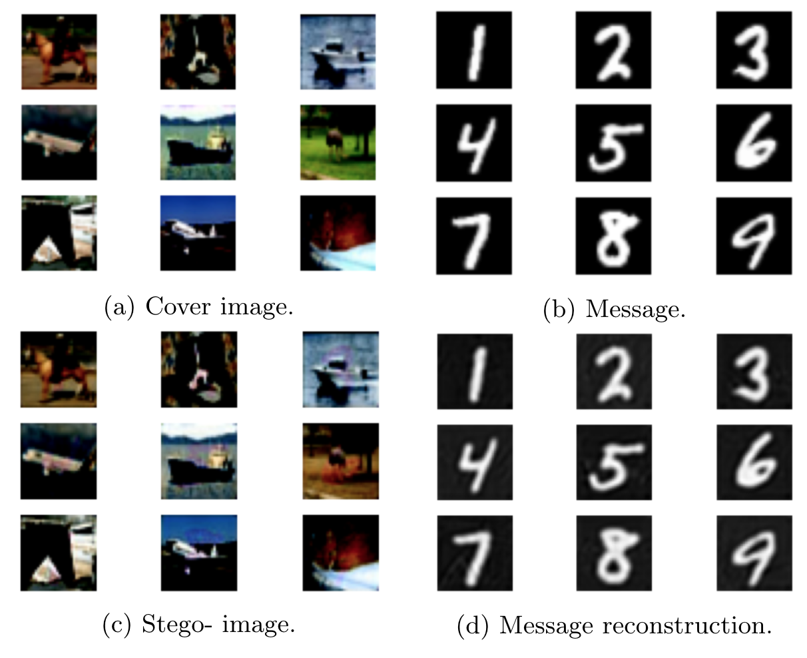

# Deep Steganography
DCU and UPC Bachelor's Final Thesis

Deep Steganography is an steganography hidding system of images within other images.
The system designed is able to create, from an cover image and a message, a new steganography image. This new stego-image looks as similar as possible as the cover but has the message hidden in it.
Our approach adopts the U-net architecture and combines two reconstruction losses to provide a simple yet effective approach tested in low resolution images from MNIST, CIFAR and ImageNet.

In our experiments we used three well-known low resolution datasets for fast prototyping: MNIST \cite{MNIST}, CIFAR10 \cite{CIFAR10} and a down-sampled ImageNet \cite{ImageNet}. We used 50,000 images for training and 10,000 images for testing. We trained the model for 100 epochs and set the learning rate to 0.01 and used the SGD optimizer and mean square error (L2) as loss.

The particularity of the training procedure is that two loss terms needed to be balance: a reconstruction loss for the stego-image compared to the cover image, and a reconstruction loss for the message image.
The two L2 were linearly weighted and their parameters were set after a naive hyper-parameter search.

We performed two types of experiments hiding both graysalce and RGB images into RGB images. First, an MNIST image was hidden into a CIFAR10 image (see image below) and an ImageNet image was later hidden into a CIFAR10 image. 

